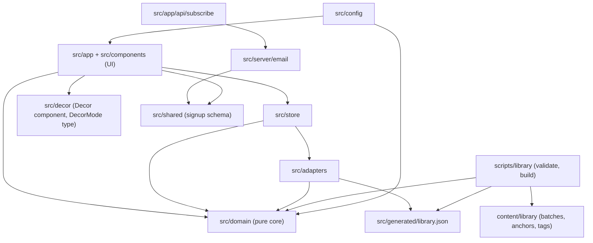
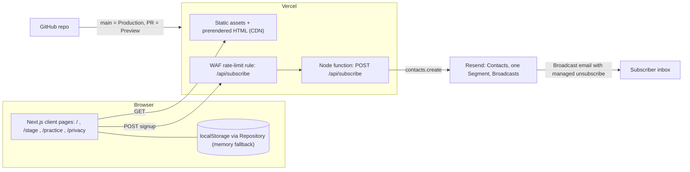
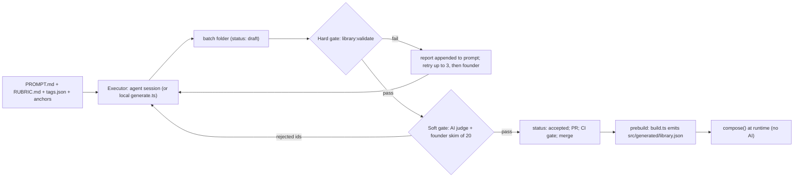

# Architecture Spine — Impromptu v1

## Design Paradigm

**Functional core / imperative shell.** All product rules live in a pure TypeScript core (`src/domain`) that knows nothing about React, Next.js, three.js, or the browser. It talks to the outside world only through four ports. Thin shells adapt it to the UI, storage, the decorative 3D layer, the signup route, and the offline library pipeline.

| Layer | Directory | Holds |
| --- | --- | --- |
| Core (pure) | `src/domain/` | library schema, `isCompatible()`, `compose()`, Brief rendering, session state machine, timer math, Practice Map derivation, export shape |
| Ports | `src/domain/ports.ts` | `Library` (synchronous data), `Repository`, `Clock` (`now()`), `Random` (`next()`, `uuid()`) interfaces |
| Adapters | `src/adapters/` | `localStorage` + memory Repository, system Clock, crypto Random, generated-library loader |
| Client store | `src/store/` | the one app store: `setup`, `session`, and `history` slices; command layer (calls `compose()`), reducers from core, Repository persistence |
| Shared | `src/shared/` | runtime schemas used by both client and server (signup request and response) |
| UI shell | `src/app/`, `src/components/` | routes, pages, Stage, setup, Practice; renders store state, dispatches events |
| Decor shell | `src/decor/` | three.js scenes + static fallbacks; isolated |
| Server shell | `src/app/api/subscribe/`, `src/server/email/` | the only server code |
| Pipeline shell | `scripts/library/`, `content/library/` | offline generation inputs, validator, build step |



Arrows are the only allowed import directions. `src/domain` imports only `src/config` and `zod`. `src/decor` imports nothing from `src/domain`, `src/store`, or `src/adapters`. `src/server` is never imported by client code. `src/shared` imports only `zod`. Components never import `src/adapters`.

## Invariants & Rules

### AD-1 — Static-first Next.js on Vercel, one server endpoint [ADOPTED]

- **Binds:** all; NFR-3, NFR-4, NFR-5
- **Prevents:** server data paths, API routes, or server-rendered user state creeping in feature by feature.
- **Rule:** App Router, every page statically prerendered (no dynamic server rendering, no Server Actions, no `proxy.ts`). `POST /api/subscribe` is the only server code. No accounts, no database, no runtime AI call anywhere in `src/`. Routes are fixed: `/` (landing + setup), `/stage` (Challenge Stage), `/practice` (Practice History + Practice Map), `/privacy`, `POST /api/subscribe`. Challenge state is never encoded in the URL. Scaffold with `npx create-next-app@16.4.0 impromptu --ts --tailwind --eslint --app --src-dir --import-alias "@/*" --no-cache-components --no-react-compiler`. Cache Components stays off, overriding the 16.4 default, so routes unmount normally and every page prerenders as a plain static shell.

### AD-2 — Pure core, ports, and dependency direction

- **Binds:** all units
- **Prevents:** generator, timer, or session logic duplicated inside components and drifting between setup, Stage, and Practice.
- **Rule:** Imports follow the diagram above and nothing else. `src/domain` uses no `window`, `localStorage`, `Date.now()`, `Math.random()`, or `crypto`. Time comes from `Clock.now()` (epoch ms). Randomness and ids come from `Random.next()` and `Random.uuid()` (production: `crypto.getRandomValues` / `crypto.randomUUID`; tests: seeded). The `Library` port is synchronous, in-memory data. The store exposes `libraryStatus: 'loading'|'ready'`, and compose commands wait for `ready`. Hydrating the session never needs the library, because snapshots are self-contained. An ESLint `no-restricted-imports` rule enforces the boundaries.

### AD-3 — One `compose()` for every new Challenge; Retry bypasses it

- **Binds:** FR-5, FR-6, FR-8, FR-9, FR-11, FR-12
- **Prevents:** Reroll, Variation, and new Challenges each implementing their own filtering, compatibility, or repeat rules.
- **Rule:** New Challenge, Reroll, and Variation all call `compose(request, library, recent, random)` in `src/domain`. The request carries setup filters (Level, Perform timing choice, enabled Mediums, Skill focus), `locks` (Input kind → value id), and `mustDiffer` (Input kind → current value id). Variation = lock every Input except the chosen one and set `mustDiffer` on it, with the value currently held. "Change it again" is another `vary` against the held value. A changed Skill or Medium may swap the Template, at the same Level and compatible with the locked fills. The result is a union: `{ok:true, challenge}` or `{ok:false, reason:'no_compatible', blockingLock}`. The UI never receives a partial Challenge. Retry never calls `compose()`. It copies the stored Challenge snapshot under a new Challenge id with `origin:{kind:'retry', fromRepId}`. Variation sets `origin:{kind:'variation', fromRepId}`. Origin is used only for the FR-25 marking and never forms a linking graph. Only `compose()` reads setup. A held Challenge is never re-filtered when setup changes; new setup applies to the next `compose()` (FR-10). `compose()` is pure. It returns the Challenge and never writes the recent ring (see AD-11). Only the store's command layer calls `compose()`. Components never call it, and never pass a Challenge in an event payload.

### AD-4 — One compatibility function, data-driven tag semantics

- **Binds:** FR-6, CL-3, CL-4; runtime and validator
- **Prevents:** the build validator approving combinations that the runtime would reject, or the reverse; contradiction rules leaking into code branches.
- **Rule:** `isCompatible(template, medium, topic, style, constraint)` in `src/domain/library/compat.ts` is the single implementation, imported by `compose()` and by `scripts/library`. Semantics:
  - every fill has `tags[]` (traits it carries), `requires[]` (traits that must appear among the *other* parts), and `excludes[]` (traits that must not appear among the other parts);
  - a Template has a required `mediums[]` (Medium ids), `topicTags`, `styleTags`, and `constraintTags` (a fill matches when it has at least one of them), `incompatible[]` (fill ids or tags), and its own `tags[]`, which count as a part;
  - the chosen Medium's `tags[]` also count as a part, for example `med.photography` carrying `camera`;
  - every tag comes from the controlled vocabulary `content/library/tags.json`.

  No contradiction rule exists outside library data.

### AD-5 — A Challenge is an immutable snapshot

- **Binds:** FR-10, FR-11, FR-25, FR-28; Repository, Practice
- **Prevents:** regenerating or retiring library data from silently rewriting past Reps or a held Challenge.
- **Rule:** All persisted shapes are zod schemas in `src/domain/session/schema.ts` (`Challenge`, `Attempt`, `Rep`, `Setup`, `Session`, `Export`), and their types come from `z.infer`. A **Challenge** stores:
  - `id` (uuid), `createdAt` (ISO 8601), `libraryVersion`, `templateId`, `level`, `timeLimitSec|null`;
  - the rendered `brief` and `guidance|null` (the Explore guidance line, kept outside the Brief);
  - `inputs`, a record keyed by Input kind (`skill`, `medium`, `topic`, `style`, `constraint`), where each entry is `{id, revealText}`. Kinds the Template omits are absent. Reveal order always comes from `config.reveal.order`, filtered to the kinds present, and never from the snapshot;
  - `origin: {kind:'new'|'reroll'|'retry'|'variation', fromRepId|null}`.

  Once composed, a Challenge is never mutated or re-rendered. History, Retry, and export read the snapshot text only. Variation resolves ids against the current library, and if an id is gone it asks the user to pick another Input to change. Kind labels such as "Topic" come from `copy.ts`, not from the snapshot.

  A **Rep** is `{id, challenge, finishedAt (ISO), timeUsedSec|null, reflection: {worked, change}|null}`. "Timed" is derived from `challenge.timeLimitSec`. The Rep id is assigned at `finish`, and appending to history is idempotent by id. The Practice History, the Practice Map (counts by the snapshot's `skill`, `medium`, and `level`, with Retries and Variations counted as Reps), and the export all derive from Rep records only and never look anything up in the library. The **Export** is `{app:'impromptu', exportVersion, exportedAt, reps}`.

### AD-6 — Stable, namespaced library ids; retire, never delete

- **Binds:** CL-1, CL-6; pipeline, `compose()`, recent window
- **Prevents:** id collisions across batches and dangling references from Reps or the recent window.
- **Rule:** Ids follow the forms `skl.<slug>`, `med.<slug>`, `tpl.<skill-slug>.<level>.<slug>`, `top.<slug>`, `sty.<slug>`, and `con.<slug>`, lowercase kebab slugs, unique across the whole library and never reused. Removal happens only by listing ids in a later batch's `manifest.retire[]`. The id-uniqueness check applies to declarations. Batches apply in folder-name order. `compose()` skips retired entries. Lookups still resolve them.

### AD-7 — The domain owns the session state machine; one store applies it

- **Binds:** FR-9, FR-10, FR-13–FR-24, FR-30
- **Prevents:** two components holding different "current Challenge" or Attempt state, more than one Attempt, and transitions that skip persistence.
- **Rule:** The session state machine is the one in the diagram below, implemented as a pure reducer `(state, event, now) → state` in `src/domain/session`. There is at most one held Challenge and at most one Attempt.
  - **One store:** `src/store` holds one app store with three slices: `setup`, `session`, and `history`. It is the only place reducers run. After every transition it persists the changed slices through the Repository. Components dispatch commands and never write state or storage directly.
  - **Commands:** `new_challenge`, `reroll`, and `vary {fromRepId, kind}` run in the store's command layer. That layer calls `compose()` and then dispatches `challenge_committed {challenge, recentKey}` or `compose_failed {reason, blockingLock}` to the reducer. `retry {fromRepId}` copies the snapshot and dispatches `challenge_committed` with no recent key.
  - **Session events:** `reveal_next`, `toggle_lock`, `start`, `pause`, `resume`, `finish`, `update_reflection_draft`, `save_rep`, and `discard`.
  - **Setup events:** `set_level`, `set_perform_timing`, `toggle_medium`, `choose_medium`, `set_skill_focus`, `set_quick_reveal`, and `set_sound`. The guard against disabling the last Medium (FR-2) is a domain rule in the setup reducer.
  - **History events:** `clear_all_data` empties all three slices, resets setup to its defaults, and calls `Repository.clearAll()`.
  - **Transitions:** any (state, event) pair not in the diagram is a no-op.
    - `new_challenge` is rejected while an Attempt exists. The UI offers Discard first.
    - `toggle_lock` and `reroll` are accepted only once the reveal is complete and before `start`.
    - `finish` appends the Rep (reflection `null`) to history in the same transition and sets `lastRepId`. Finished persists across reloads with the reflection draft.
    - `save_rep` attaches the Reflection to that Rep (idempotent upsert by id) and moves to Saved. Empty fields are valid. It is Finished's only exit. Leaving `/stage` from Finished (back or Esc) dispatches `save_rep` with the current draft.
    - `retry` and `vary` are accepted only from Saved. Practice History rows are read-only in v1.
    - `compose_failed` keeps the current state and sets `lastComposeError`, which the UI shows naming the Lock or Input to change.
  - **Navigation:** leaving `/stage` never changes the session. A held Challenge persists until a later `challenge_committed` replaces it. Opening `/stage` with nothing held dispatches `new_challenge` once `libraryStatus` is `ready`. The Attempt keeps running when the user leaves `/stage`. Setup shows Resume / Discard from the same store.
  - **Keyboard:** one Stage-level handler owns the keys. Esc goes to `/` only when no Attempt exists. Space and Enter fire `reveal_next` only when no control has focus; on the focused Reveal next (sun) button they use native button activation. The Stage focuses Reveal next on entry.

### AD-8 — Timers are derived from wall-clock timestamps

- **Binds:** FR-18, FR-20, FR-21
- **Prevents:** a ticking counter that drifts in background tabs, resets on reload, or disagrees between the Stage and setup.
- **Rule:** An Attempt stores `startedAt` (epoch ms, set on `start`), `pausedAt|null`, `pausedTotalMs`, and `timeLimitSec|null`. Elapsed time is `now − startedAt − pausedTotalMs − (pausedAt ? now − pausedAt : 0)`. Remaining time and `timeUp` are always computed and never stored. UI ticks only re-render. No time value exists before `start`. On finish, `timeUsedSec` is stored: elapsed, capped at the limit when timed.

### AD-9 — Repository is the sole storage accessor, versioned, with memory fallback [ADOPTED]

- **Binds:** FR-4, FR-10, FR-21, FR-27, FR-28, FR-29; NFR-4
- **Prevents:** ad-hoc `localStorage` keys, schema changes that wipe data, and crashes in private mode.
- **Rule:** Only `src/adapters/storage` touches `localStorage`. It uses three keys:
  - `impromptu:setup` holds the `Setup` schema: Level, Perform timing choice, enabled Mediums, chosen Medium or random, Skill focus, Quick reveal, sound on/off, and `ambientMotion` (the Motion toggle). Defaults come from `config.setup.defaults`.
  - `impromptu:session` holds the held Challenge, reveal progress, Locks, Attempt, the Finished reflection draft, `lastRepId`, `lastComposeError`, and the recent ring. A commit therefore writes the session and the ring together.
  - `impromptu:history` holds the Reps.

  Each value is an envelope `{v: <int>, rev: <int>, data}`. `rev` increases on every write. Before writing, the store checks that the stored `rev` still matches the one it last read. If not, it re-reads, re-applies the event to the fresh state, or drops it when it is no longer valid. This keeps two tabs from creating two Attempts. `Repository.clearAll()` removes every `impromptu:*` key. Reads run forward-only migrations `vN→vN+1` from `src/adapters/storage/migrations`. A value with a version above the known one is left untouched and treated as read-only. If a migration throws, the stored value is left untouched, the app runs on memory for that key, and it shows the UX banner. A failed migration never overwrites or deletes data. Availability is probed once at startup (write, read, remove). On failure, a memory adapter with the same interface is used, and `storageAvailable=false` drives the FR-29 copy. The adapter subscribes to the `storage` event so the store re-reads changes made in another tab. The UI always derives from the store and never keeps a component-local copy of session data.

### AD-10 — No stored state in server or first-client render

- **Binds:** all pages
- **Prevents:** hydration mismatches between static HTML and per-browser state.
- **Rule:** The store hydrates from the Repository in an effect and exposes `status: 'loading'|'ready'`. Until it is `ready`, components render a neutral placeholder and never branch on stored values. Every component that reads the store is a Client Component.

### AD-11 — The recent-repeat window counts committed Challenges

- **Binds:** FR-8, CL-2; NFR-6
- **Prevents:** inconsistent repeat behavior between Reroll, Variation, and new Challenges.
- **Rule:** The session slice keeps a ring of the last `config.generator.recentWindow` (30) `templateId+topicId` keys. A key is pushed when a composed Challenge is committed to the held state: new, Reroll, Variation, or "Change it again". Committed means shown on the Stage, which is what FR-8 calls revealed. The reducer pushes it while handling `challenge_committed`, so it is written in the same session write. Retry does not push. `compose()` excludes keys in the ring whenever any alternative exists, and otherwise allows the repeat.

### AD-12 — Decor is an isolated, freezable, text-free layer [ADOPTED]

- **Binds:** NFR-3, NFR-7, FR-15, FR-17, FR-31, FR-33
- **Prevents:** 3D carrying content, blocking first interaction, animating while a Challenge is held, or reading app state.
- **Rule:**
  - **Component and loading:** `src/decor` exports one Client Component, `<Decor scene="hero"|"shuffle" mode="ambient"|"shuffle"|"frozen" />`. It renders the static image fallback from `public/decor/` immediately. A tiny gate module that does not import three runs after mount, and only if the gate passes does the component load the three.js scene with `next/dynamic` and `ssr:false`. The scene uses three.js directly (no React Three Fiber).
  - **Gate:** a WebGL2 context can be created, `prefers-reduced-motion` is not `reduce`, and the device is not low-power (`deviceMemory ≤ 4`, `hardwareConcurrency ≤ 4`, or `saveData`). If the gate fails, the static fallback stays.
  - **Freeze:** `frozen` calls `renderer.setAnimationLoop(null)` and keeps the last frame. The loop also stops on `document.hidden`. All GPU resources are disposed on unmount.
  - **Containment:** the canvas is `aria-hidden`, `pointer-events:none`, and placed outside the safe area. It never draws text.
  - **Control:** the page sets `mode`. On `/`, the hero stays `ambient`, even while an Attempt exists. On `/stage`, `mode` comes from session state, and `frozen` is required whenever the reveal is complete or an Attempt exists. Once a Challenge has been held on a Stage visit, decor stays frozen for the rest of that visit, including during Reroll piece shuffles, which use DOM animation only.

### AD-13 — No third-party runtime requests

- **Binds:** NFR-5; all units
- **Prevents:** analytics, tracking, or font and CDN calls quietly breaking the privacy note.
- **Rule:**
  - The browser fetches only same-origin resources.
  - Fonts (Bodoni Moda, Unbounded, Instrument Sans) come through `next/font/google`, self-hosted at build time.
  - No Vercel Web Analytics or Speed Insights, no third-party scripts, and no client error monitoring.
  - The only outbound call is server-side, from `/api/subscribe` to Resend.
  - Server logs never contain an email address.

### AD-14 — Signup contract: one Resend Segment, explicit consent, edge rate limit [ADOPTED]

- **Binds:** FR-35, FR-36, FR-37
- **Prevents:** key exposure, consent-less contacts, divergent client and server error handling, and an in-app limiter that needs its own store.
- **Rule:**
  - **Request:** `POST /api/subscribe` runs as a Node runtime Route Handler. It accepts JSON `{email, consent, consentTextVersion, website}`, validated by one zod schema in `src/shared/subscribe.ts`. The client form and the server both run that schema, so the email check never differs between them.
  - **Honeypot:** a non-empty `website` field returns `{ok:true}` without calling Resend.
  - **Consent:** `consent` must be `true`.
  - **Resend call:** `resend.contacts.create({email, unsubscribed:false, segments:[{id: RESEND_SEGMENT_ID}], properties:{consent_at, consent_text_version}})`. The server sets `consent_at` (ISO 8601). The client never sends it. Both properties are custom contact properties of type string. They are created in each environment's Resend account before launch, as part of the AD-20 checklist.
  - **Existing contact:** because Resend does not document a duplicate-email error, the route does not rely on one. If `create` returns an error, it looks the contact up by email. If the contact exists, the route adds it to the Segment ("add contact to segment") and updates the two properties, without touching its `unsubscribed` flag, then returns `{ok:true}`. Any other error returns `unavailable`. A Preview smoke test signs up the same address twice.
  - **Response:** `{ok:true}` or `{ok:false, error:'invalid_email'|'consent_required'|'rate_limited'|'unavailable'}`. The client adds `offline` when the fetch itself fails (NFR-4). Copy keys are exactly these five codes.
  - **Rate limit:** one Vercel WAF rate-limit rule on `/api/subscribe`: fixed window, keyed by IP, 5 requests per 60 s, responding 429. Hobby allows one such rule. Counters are kept per region, so the limit is approximate. The client maps a 429 to `rate_limited`. There is no in-app limiter.
  - **Unsubscribe:** updates go out as Resend Broadcasts to the one Segment. Every Broadcast includes `{{{RESEND_UNSUBSCRIBE_URL}}}` and the sender's physical address. The app has no unsubscribe route.

### AD-15 — One zod schema defines the library [ADOPTED shape, decided format]

- **Binds:** CL-1, CL-6; pipeline, runtime
- **Prevents:** the generator, the validator, and the runtime disagreeing on field names or shapes.
- **Rule:** `src/domain/library/schema.ts` defines `Skill`, `Medium`, `Template`, `Topic`, `Style`, `Constraint`, `Tag`, `Anchor`, and `BatchManifest` in zod. TypeScript types come only from `z.infer`, with no hand-written parallel interfaces. Source data is JSON under `content/library/`.
  - **Templates:** each has a required `mediums[]`. `briefPattern` is a string, or a map keyed by Medium id whose keys must be a subset of `mediums`. Slots are `{topic}`, `{style}`, and `{constraint}`. A Template can omit a slot, for example Style at Explore. `guidance` is optional, allowed at Explore only, and never part of the Brief.
  - **Fills:** every Topic, Style, and Constraint has `id`, `revealText` (what its Reveal piece shows), `briefText` (the phrase rendered into the Brief slot), `tags`, `requires`, `excludes`, and `retired?`. `src/domain/library/render.ts` is the single Brief renderer.
  - **Time Limits:** `timeLimitSec` appears only when `level === 'perform'`.
  - **Skills and Mediums:** both are library data in `skills.json` and `mediums.json` (`id`, `revealText`, `info`, `tags`), not code. They are the only source for their display text and for the Skill info control (FR-3).

### AD-16 — Library hard gate runs inside every build

- **Binds:** CL-2, CL-3, CL-4, CL-5, FR-6, FR-7; SM-3
- **Prevents:** a contradictory, uncovered, or malformed library ever reaching a deployment.
- **Rule:** `scripts/library/build.ts` runs on `predev` and `prebuild`. It loads `content/library/anchors/` and every batch whose `manifest.status === 'accepted'`, runs the hard gate, and only then emits `src/generated/library.json` with `libraryVersion` set to a content hash. `src/generated/` is gitignored. Any gate failure exits non-zero, so the Vercel build fails. The gate checks:
  - **Data integrity:** the schema; ids unique across batches; every tag and id reference resolves.
  - **Brief rendering:** slots match the declared fills; a rendered Brief has no leftover braces, is 1–3 sentences, and is at most 160 characters (`stage-brief-max-chars` in DESIGN.md, so the held Challenge fits at 1280×800).
  - **Time Limits:** no Time Limit below Perform.
  - **Coverage:** at least 2 active Templates for every Skill × Level × Medium cell.
  - **Reachability:** exhaustive enumeration through `isCompatible()`. Every Template yields at least 3 valid combinations, and no reachable combination violates requires or excludes.
  - **Repeat headroom:** at least 60 distinct `templateId+topicId` combinations for every Level × Medium setup with Skill random. Skill-focused setups get a warning, not a failure, below 31.
  - **Style and Constraint wording (CL-4):** a lint flags Styles phrased as rules and Constraints phrased as moods.
  - **Anchors:** each of the three CL-5 anchors is `{templateId, mediumId, topicId, styleId, constraintId, expectedBrief}` in `content/library/anchors/anchors.json`. Their Templates and fills are ordinary entries in `anchors/`, transcribed from the founder's spec. The gate renders each anchor through `render.ts` and string-compares the result to `expectedBrief`.

### AD-17 — Batch lifecycle: atomic, reviewed, append-only (resolves PRD OQ-1)

- **Binds:** CL-6, CL-3; library pipeline
- **Prevents:** partial or unreviewed batches shipping, hand-authored drift, and in-place rewrites of accepted content.
- **Rule:** The pipeline is a batch contract, independent of the tool that generates it. See the *Library pipeline* diagram.
  - **Folder:** a batch is one folder, `content/library/batches/<YYYY-MM-DD>-<kind>-<scope>-<nn>/`, containing `manifest.json` and that kind's JSON file(s).
  - **Manifest:** carries `status: draft|accepted`, `generator {tool, model, promptVersion}`, `rubricVersion`, `review {judge, founderSample, rejectedIds, date}`, `edits[]`, and `retire[]`.
  - **Generation inputs:** `content/library/pipeline/PROMPT.md` and `RUBRIC.md`, both versioned. The prompt embeds the CL-5 anchors, the tag vocabulary, the target cells, and the previous gate report when regenerating.
  - **Sizes:** a Template batch is one Skill × one Level across all four Mediums, 12 Templates (at least 3 per Medium). A fill batch is one kind, 40 entries. Fills come before Templates.
  - **Order:** the hard gate (AD-16, `npm run library:validate`) runs first. The soft gate follows: an independent AI-judge pass scores every rendered sample against `RUBRIC.md`, and the founder skims 20 random rendered Challenges.
  - **Failure:** any hard failure rejects the whole batch. The executor regenerates with the report appended, at most 3 times, then escalates the cell to the founder. Rubric-rejected ids are regenerated inside the same batch, never hand-rewritten. Only typo fixes may be hand-edited, and each is logged in `edits[]`.
  - **Landing:** one PR per batch. CI runs the hard gate. A batch merges only as `accepted`. Accepted batches are never edited afterwards. Fixes arrive as new patch batches that retire ids through `retire[]` and declare replacements under new ids.
  - **Executor:** the default is an AI coding-agent session. Pipeline scripts run with `tsx`. An optional `scripts/library/generate.ts` may read an LLM key from local `.env` only. That key is never committed, never set in Vercel, and never imported by `src/`.

### AD-18 — Reveal progress is domain state; animation only renders it

- **Binds:** FR-13, FR-14, FR-15, FR-17, FR-18; NFR-1
- **Prevents:** animation components owning reveal progress, auto-advancing, or announcing steps differently.
- **Rule:**
  - **Order and progress:** the reveal order comes from `config.reveal.order` (Skill, Medium, Topic, Style, Constraint, then Brief) and skips any slot the Template omits. The held session stores `revealed`, the set of kinds already landed. It persists, so a reload resumes at the same step.
  - **Events:** `reveal_next` lands the next kind in order.
  - **Quick reveal:** a setup preference, not an event. When `setup.quickReveal` is on, `challenge_committed` lands every kind at once, and the UI plays a single transition of at most `config.reveal.quickMaxMs`.
  - **Reroll and Variation:** a Reroll un-lands only the kinds that changed. Locked kinds stay landed. The user then reveals the changed kinds in order, unless Quick reveal is on. A Variation un-lands only the changed kind.
  - **Rendering:** animations render from `revealed` and never change it. Under reduced motion they fall back to fades or instant states.
  - **Announcements:** one polite live region owned by the Stage announces each landed Input and the Brief.
  - **Retry:** a Retry commits with every kind already landed, so no Reveal plays.

### AD-19 — One config module for tunables

- **Binds:** NFR-6, FR-8, FR-14, FR-23
- **Prevents:** magic numbers scattered across UI code.
- **Rule:** `src/config/app.ts` is the only source for these values:
  - `generator.recentWindow`: 30;
  - `reveal.quickMaxMs`: 1000;
  - `reveal.order`;
  - `setup.defaults`: Level `explore`, Perform timing `either`, all Mediums enabled, Medium random, Skill random, Quick reveal off, sound off, `ambientMotion` on (`prefers-reduced-motion: reduce` always wins);
  - `reflection.maxChars`: 280;
  - `storage.schemaVersions`;
  - `signup.consentTextVersion`.

  Mediums and Time Limits live in library data. UI code imports these values and never hard-codes them.

### AD-20 — Environments and secrets

- **Binds:** FR-35; operations
- **Prevents:** previews writing to the real mailing list, and secrets reaching the client or the repo.
- **Rule:** Two Vercel environments exist. Production deploys from `main`. Preview deploys every other branch and PR. `RESEND_API_KEY` and `RESEND_SEGMENT_ID` are set per environment, and Preview points at a separate test Segment. No variable carries the `NEXT_PUBLIC_` prefix. These are the only secrets. `engines.node` is `24.x`. The following steps must be done before the first Broadcast and are tracked as launch-checklist stories:
  - attach a custom domain to Vercel;
  - set up a Resend sending domain on that domain with SPF and DKIM verified;
  - create the two Segments, plus the `consent_at` and `consent_text_version` string contact properties, in each Resend environment;
  - add the WAF rule and confirm that it applies to Preview traffic too;
  - turn on Vercel Deployment Protection for Preview, so test signups are not publicly reachable.

  Rollback uses Vercel Instant Rollback to the previous Production deployment. No server data needs migrating, because user data lives in browsers and contacts live in Resend. Erasure requests are handled by deleting the contact in Resend, and the privacy note says so. The app holds no email data to delete.

## Consistency Conventions

| Concern | Convention |
| --- | --- |
| Naming | Domain terms exactly as in the PRD Glossary (Challenge, Attempt, Rep, Lock, Reroll, Variation, Retry, Practice History, Practice Map). Files are kebab-case. React components are PascalCase. Store events are snake_case verbs. Input kinds are `skill`, `medium`, `topic`, `style`, `constraint`. Level ids are `explore`, `experiment`, `develop`, `perform`. Skill and Medium ids follow AD-6 (`skl.idea-generation`, `med.spoken-storytelling`). |
| Ids & dates | Challenge and Rep ids come from `Random.uuid()`. Library ids follow AD-6. Persisted timestamps are epoch ms in Attempt timing and ISO 8601 strings everywhere else. Durations are stored in seconds (`*Sec`) or ms (`*Ms`), and the suffix is mandatory. |
| Results & errors | Domain functions that can fail return `{ok:true,…}` or `{ok:false, reason}` and never throw for expected cases. User-facing copy for each `reason` lives in one copy map in `src/components/copy.ts` (working copy until the founder finalizes it). Copy for discard, time's up, empty states, and errors never signals failure, scores, streaks, or improvement (PRD §6 voice, §8). |
| No-penalty guardrail | The UI shows no Reroll counters, no overtime count past zero, no Level suggestions or gating, no day-gap or streak figures, and no quality language. Whether a step asks for confirmation is decided in EXPERIENCE.md. |
| Signup placement | The signup form appears only in the footer and after a saved Rep. It never appears as a modal, never appears during a Reveal or Attempt, and never gates anything (FR-35, SM-C1). |
| State mutation | Only through store events (AD-7). Only the Repository writes storage (AD-9). |
| Styling | Tailwind v4 with design tokens as CSS custom properties in one file (`src/styles/tokens.css`, `@theme`), sourced from DESIGN.md / Cutout `tokens.json`. Components use no raw hex or px font sizes outside the tokens. Stage type minimums are tokens. |
| Accessibility | Every interactive element is a native control or has an ARIA role. Focus stays visible. The Difficulty Dial is one ARIA slider. Decoration is `aria-hidden`. Reduced motion is read from one `usePrefersReducedMotion` hook. |
| Testing | Domain: Vitest with seeded `Random` and fake `Clock`, colocated `*.test.ts`. E2E: Playwright in `e2e/`, covering the keyboard path, reduced-motion emulation, and the FR-34 legibility check (computed Brief ≥ 32 px and Inputs ≥ 24 px at 1920×1080, everything essential inside the safe area, screenshot downscaled to 960×540 for review). |
| Browser support | The current and previous versions of Chrome, Safari, Firefox, and Edge, plus iOS Safari and Android Chrome. Playwright runs Chromium, WebKit, and Firefox. |
| CI | A GitHub Action on each PR runs lint, typecheck, `library:validate`, vitest, and playwright. The Vercel build reruns the library gate via `prebuild`. |

## Stack

| Name | Version |
| --- | --- |
| Node.js (Vercel runtime) | 24.x |
| Next.js (App Router, Turbopack; create-next-app defaults) | 16.4.0 |
| React / React DOM | 19.3.0 |
| TypeScript (starter's `^5` line) | 5.9.3 |
| Tailwind CSS | 4.3.3 |
| three.js | 0.186.1 |
| @types/three | 0.186.0 |
| zod | 4.6.5 |
| resend (Node SDK) | 6.32.1 |
| eslint-config-next | 16.4.0 |
| Vitest | 5.0.3 |
| Playwright (@playwright/test) | 1.64.0 |
| Vite (Vitest peer) | 8.3.4 |
| @types/node | ^24 |
| tsx (pipeline scripts) | 4.23.15 |
| Hosting | Vercel (Hobby, WAF rate-limit rule) |
| Email provider | Resend (Contacts + one Segment + Broadcasts) |

## Structural Seed

### System and deployment



### Session state machine (AD-7)

```mermaid
stateDiagram-v2
  [*] --> None
  None --> Held: challenge_committed
  None --> None: compose_failed (lastComposeError)
  Held --> Held: reveal_next, toggle_lock, challenge_committed (reroll or new), compose_failed
  Held --> Attempt: start (all kinds landed)
  Attempt --> Attempt: pause, resume (timeUp derived, never stored)
  Attempt --> Finished: finish (Rep appended, lastRepId)
  Attempt --> None: discard (nothing saved)
  Finished --> Finished: update_reflection_draft
  Finished --> Saved: save_rep (Reflection attached; also on leaving /stage)
  Saved --> Held: challenge_committed (retry, vary, new)
  Saved --> Saved: compose_failed
```



### Core entities

```mermaid
erDiagram
  TEMPLATE ||--o{ CHALLENGE : "resolved into"
  TOPIC |o--o{ CHALLENGE : fills
  STYLE |o--o{ CHALLENGE : fills
  CONSTRAINT |o--o{ CHALLENGE : fills
  TAG }o--o{ TEMPLATE : "accepts / carries"
  TAG }o--o{ TOPIC : "carries / requires / excludes"
  BATCH ||--|{ TEMPLATE : contains
  BATCH ||--|{ TOPIC : contains
  CHALLENGE ||--o| ATTEMPT : "started as"
  ATTEMPT ||--o| REP : "finished as"
  REP ||--o| REFLECTION : has
  REP |o--o{ CHALLENGE : "origin of retry/variation"
```

### Library pipeline (AD-15–AD-17)



### Source tree

```text
impromptu/
  content/library/
    tags.json                 # controlled tag vocabulary
    anchors/                  # the three CL-5 Challenges, verbatim
    batches/<batchId>/        # manifest.json + templates|topics|styles|constraints.json
    pipeline/                 # PROMPT.md, RUBRIC.md (versioned)
  scripts/library/            # validate.ts, build.ts, (optional) generate.ts
  src/
    app/                      # routes: page.tsx (/), stage/, practice/, privacy/, api/subscribe/route.ts
    components/               # setup, stage, reveal pieces, practice, signup form, copy.ts
    decor/                    # three.js scenes + static fallbacks (isolated)
    domain/                   # library/ (schema, compat, render), compose/, session/, timer/, practice/, ports.ts
    adapters/                 # storage/ (+ migrations), clock, random, library-loader
    store/                    # session store (useSyncExternalStore)
    server/email/             # Resend client (server-only)
    shared/                   # subscribe.ts: request/response schema used by client and server
    config/app.ts
    styles/tokens.css
    generated/                # library.json (gitignored, built)
  public/decor/               # static fallback artwork
  e2e/                        # Playwright
```

## Capability → Architecture Map

| Capability / Area | Lives in | Governed by |
| --- | --- | --- |
| 4.1 Challenge Setup (FR-1–4) | `src/app/page.tsx`, `src/components/setup` | AD-7, AD-9, AD-10, AD-19 |
| 4.2 Challenge Generator (FR-5–12) | `src/domain/compose`, `src/domain/library` | AD-3, AD-4, AD-5, AD-6, AD-11 |
| 4.3 The Reveal (FR-13–18) | `src/components/stage`, `src/domain/session` | AD-18, AD-12, AD-7 |
| 4.4 Creating and Timed (FR-19–21) | `src/domain/timer`, `src/domain/session` | AD-7, AD-8, AD-9 |
| 4.5 Completion and Reflection (FR-22–24) | `src/components/stage`, `src/domain/session` | AD-7, AD-3, AD-19 |
| 4.6 Practice History and Map (FR-25–29) | `src/app/practice`, `src/domain/practice` | AD-5, AD-9, AD-10 |
| 4.7 Challenge Stage (FR-30–34) | `src/app/stage`, `src/components/stage` | AD-1, AD-12, AD-18, Styling and Testing conventions |
| 4.8 Email Updates (FR-35–37) | `src/app/api/subscribe`, `src/server/email`, signup form | AD-14, AD-13, AD-20 |
| Library CL-1–CL-6, PRD OQ-1 | `content/library`, `scripts/library` | AD-4, AD-6, AD-15, AD-16, AD-17 |
| NFR-1 Accessibility | all UI | Accessibility convention, AD-18 |
| NFR-2 Responsive | `src/components`, tokens | Styling convention |
| NFR-3 / NFR-7 Performance, 3D | `src/decor`, library chunk | AD-1, AD-12; the library chunk is prefetched on idle from setup |
| NFR-4 Reliability | client store, Repository | AD-1, AD-9; the library is bundled client-side, so generation works offline after the first load |
| NFR-5 Privacy | all | AD-13 |
| NFR-6 Configurability | `src/config`, library data | AD-19, AD-15 |

## Deferred

- **Final UI copy:** owned by the founder. It lands in `src/components/copy.ts` with no architectural impact.
- **Visual tokens, piece treatments, and Stage layout values:** owned by bmad-ux (DESIGN.md / EXPERIENCE.md). They fill `tokens.css` and the components under the conventions above.
- **Reveal sounds:** the asset format and loading are an implementation detail. Sound is off by default, and its preference persists in setup (FR-16).
- **CSV/text export and import of Practice History:** stretch. Export is JSON only, using the AD-5 snapshot shape.
- **Full offline / PWA (service worker):** stretch (NFR-4). Revisit if testers ask for it.
- **Double opt-in and a welcome email:** not in v1. Revisit if deliverability or legal review requires it.
- **Error monitoring and alerting:** none in v1 because of AD-13. Vercel function logs (with no email addresses) are the only operational signal. Revisit if signup failures go unnoticed.
- **Vercel plan:** Hobby assumed. Move to Pro if the project turns commercial.
- **Library tuning:** launch volumes (about 288 Templates, 160 Topics, 32 Styles, 64 Constraints), the 2-per-cell coverage bar, and the 160-character Brief cap are starting values. The founder or UX may tune them in the validator config.
- **React Three Fiber:** rejected for v1 (AD-12). Revisit only if the decor grows beyond two scenes.
- **TypeScript 7:** stay on the starter's 5.x line until create-next-app adopts 7.
